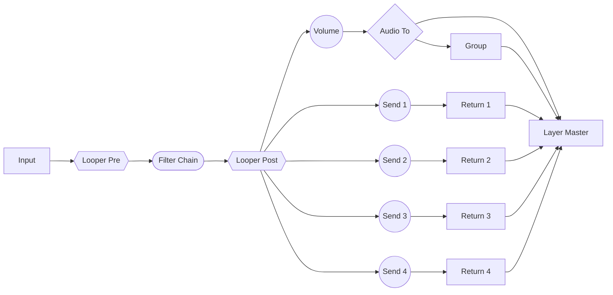
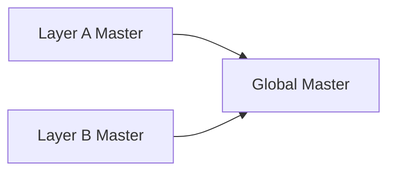

+++
title = "Audio Routing"
weight = 1
+++

Sonic Eddy provides five channel types in order to provide the user with
flexible ways to organize the signal flow. The normal audio channels take any
pipewire node as input, and route its signal either to a group, or a master
channel, and to any combination of the 4 return channels.

Group and master channels allow processing of the sum of multiple channel
signals.

Sonic Eddy provides two layers, layer A and layer B. Each layer provides 8
channels, 4 group channels, and a master channel. The master channels come
together in the global master, where the contribution of each layer is selected
by a cross-fader. This setup provides easy setup of two different signal path
that can easily be used during a live session.

Another live performance focused tool every channel, except the return channels
provide, is a looper, which can record either the pre-, or post-filter signal of
each channel, and allows replacing the live signal with a perfectly tempo
aligned recording.

## Channels

Each channel picks up audio signals from exactly one pipewire playback node. The
connection is managed by wireplumber and created by setting the target node on
the relevant node of the channel. The signal goes through a trim section, where
it can be raised, or lowered depending on the needs of the signal chain.

Next follows the pre-effects looper, and then the optional filter chain. The
send section after the filter chain allows routing the signal to one of the four
return channels of the layer.

The post-effect looper allows recording and playback of the signal effected by
the filter chain. The following volume and pan section allows setting volume and
pan, and the audio to routing section finally allows the selection of the
channels destination, either the layers master channel, or one of the group
channels.

## Group Channels

Group channels get their signal fed by normal channels. The signal of every
normal channel is summed and then processed, starting with the pre-effects
looper. The pre-effects looper is followed by the optional filter chain, the
post-effects looper, and the send section.

The following volume and pan section allows mixing the signal into the master
channel.

## Return Channels

The return channels are fed by the send section of the normal channels and the
group channels. Signal they receive is processed by an optional filter chain,
and then a volume and pan section, mixing the signal into the layers master
channel.

## Global Master

The global master channel sums layer A master and layer B master together with a
cross-fader. A filter chain can be added after the cross-fader, processing the
summed signal.

## Channel Signal Flow

Sonic Eddy channels takes inputs from any pipewire playback node, connecting to
the first two ports of the node. Virtual inputs can be used, if better control
over the respective ports is required.

The inputs are routed through a channel. Channels can have a filter chain or
external effect, which applies LV2 plugins to the audio signal. Every channel
also has two looper, one before the filter chain, one after. The looper allow to
record incoming audio, and play it back perfectly synchronized. This allows, for
example, to completely change the settings of a synthesizer while the looper
plays the old melody.

Further processing is split after the post effects looper. Four send controls
allow passing the signal to one of the four return channels. The main audio
stream is processed by a volume and pan section, and then forwarded either
directly to the layer master, or to one of the group channels of the layer. The
target is selected in the Audio To section.





The group and return channels can also contain a filter chain or external
effects, providing ample opportunities to shape the audio signal.

## Channel Controls

Each channel has very similar controls, only depending on which features the
specific channel presents to the user.

### Normal Channels

### Group Channels

### Master Channels

## The Two Layers

### The Global Master

The global master channel can be accessed with the main menu at
`Mixer -> Global Master`.

## Signal Flow

The, mostly, complete signal flow is shown in the diagram below.

```mermaid
graph LR
  subgraph LayerA[Layer A]
    InA[Input A] --> ChA1[Channel 01] --> MasterA[Master A]
    InB[Input B] --> ChA2[Channel 02] --> MasterA
    InC[Input C] --> ChA3[Channel 03] --> MasterA
    InD[Input D] --> ChA4[Channel 04] --> MasterA
    InE[Input E] --> ChA5[Channel 05] --> MasterA
    InF[Input F] --> ChA6[Channel 06] --> MasterA
    InG[Input G] --> ChA7[Channel 07] --> MasterA
    InH[Input H] --> ChA8[Channel 08] --> MasterA

    ChA1 -.-> GA1([Group 1]) -.-> MasterA
    ChA2 -.-> GA1
    ChA3 -.-> GA1
    ChA4 -.-> GA1
    ChA5 -.-> GA1
    ChA6 -.-> GA1
    ChA7 -.-> GA1
    ChA8 -.-> GA1
    ChA1 -.-> GA2([Group 2]) -.-> MasterA
    ChA2 -.-> GA2
    ChA3 -.-> GA2
    ChA4 -.-> GA2
    ChA5 -.-> GA2
    ChA6 -.-> GA2
    ChA7 -.-> GA2
    ChA8 -.-> GA2
    ChA1 -.-> GA3([Group 3]) -.-> MasterA
    ChA2 -.-> GA3
    ChA3 -.-> GA3
    ChA4 -.-> GA3
    ChA5 -.-> GA3
    ChA6 -.-> GA3
    ChA7 -.-> GA3
    ChA8 -.-> GA3
    ChA1 -.-> GA4([Group 4]) -.-> MasterA
    ChA2 -.-> GA4
    ChA3 -.-> GA4
    ChA4 -.-> GA4
    ChA5 -.-> GA4
    ChA6 -.-> GA4
    ChA7 -.-> GA4
    ChA8 -.-> GA4

    ChA1 -.-> RA1([Return 1]) -.-> MasterA
    ChA2 -.-> RA1
    ChA3 -.-> RA1
    ChA4 -.-> RA1
    ChA5 -.-> RA1
    ChA6 -.-> RA1
    ChA7 -.-> RA1
    ChA8 -.-> RA1
    ChA1 -.-> RA2([Return 2]) -.-> MasterA
    ChA2 -.-> RA2
    ChA3 -.-> RA2
    ChA4 -.-> RA2
    ChA5 -.-> RA2
    ChA6 -.-> RA2
    ChA7 -.-> RA2
    ChA8 -.-> RA2
    ChA1 -.-> RA3([Return 3]) -.-> MasterA
    ChA2 -.-> RA3
    ChA3 -.-> RA3
    ChA4 -.-> RA3
    ChA5 -.-> RA3
    ChA6 -.-> RA3
    ChA7 -.-> RA3
    ChA8 -.-> RA3
    ChA1 -.-> RA4([Return 4]) -.-> MasterA
    ChA2 -.-> RA4
    ChA3 -.-> RA4
    ChA4 -.-> RA4
    ChA5 -.-> RA4
    ChA6 -.-> RA4
    ChA7 -.-> RA4
    ChA8 -.-> RA4

    GA1 -.-> RA1
    GA1 -.-> RA2
    GA1 -.-> RA3
    GA1 -.-> RA4
    GA2 -.-> RA1
    GA2 -.-> RA2
    GA2 -.-> RA3
    GA2 -.-> RA4
    GA3 -.-> RA1
    GA3 -.-> RA2
    GA3 -.-> RA3
    GA3 -.-> RA4
    GA4 -.-> RA1
    GA4 -.-> RA2
    GA4 -.-> RA3
    GA4 -.-> RA4
  end

  subgraph LayerB[Layer B]
    InI[Input I] --> ChB1[Channel 01] --> MasterB[Master B]
    InJ[Input J] --> ChB2[Channel 02] --> MasterB
    InK[Input K] --> ChB3[Channel 03] --> MasterB
    InL[Input L] --> ChB4[Channel 04] --> MasterB
    InM[Input M] --> ChB5[Channel 05] --> MasterB
    InN[Input N] --> ChB6[Channel 06] --> MasterB
    InO[Input O] --> ChB7[Channel 07] --> MasterB
    InP[Input P] --> ChB8[Channel 08] --> MasterB

    ChB1 -.-> GB1([Group 1]) -.-> MasterB
    ChB2 -.-> GB1
    ChB3 -.-> GB1
    ChB4 -.-> GB1
    ChB5 -.-> GB1
    ChB6 -.-> GB1
    ChB7 -.-> GB1
    ChB8 -.-> GB1
    ChB1 -.-> GB2([Group 2]) -.-> MasterB
    ChB2 -.-> GB2
    ChB3 -.-> GB2
    ChB4 -.-> GB2
    ChB5 -.-> GB2
    ChB6 -.-> GB2
    ChB7 -.-> GB2
    ChB8 -.-> GB2
    ChB1 -.-> GB3([Group 3]) -.-> MasterB
    ChB2 -.-> GB3
    ChB3 -.-> GB3
    ChB4 -.-> GB3
    ChB5 -.-> GB3
    ChB6 -.-> GB3
    ChB7 -.-> GB3
    ChB8 -.-> GB3
    ChB1 -.-> GB4([Group 4]) -.-> MasterB
    ChB2 -.-> GB4
    ChB3 -.-> GB4
    ChB4 -.-> GB4
    ChB5 -.-> GB4
    ChB6 -.-> GB4
    ChB7 -.-> GB4
    ChB8 -.-> GB4

    ChB1 -.-> RB1([Return 1]) -.-> MasterB
    ChB2 -.-> RB1
    ChB3 -.-> RB1
    ChB4 -.-> RB1
    ChB5 -.-> RB1
    ChB6 -.-> RB1
    ChB7 -.-> RB1
    ChB8 -.-> RB1
    ChB1 -.-> RB2([Return 2]) -.-> MasterB
    ChB2 -.-> RB2
    ChB3 -.-> RB2
    ChB4 -.-> RB2
    ChB5 -.-> RB2
    ChB6 -.-> RB2
    ChB7 -.-> RB2
    ChB8 -.-> RB2
    ChB1 -.-> RB3([Return 3]) -.-> MasterB
    ChB2 -.-> RB3
    ChB3 -.-> RB3
    ChB4 -.-> RB3
    ChB5 -.-> RB3
    ChB6 -.-> RB3
    ChB7 -.-> RB3
    ChB8 -.-> RB3
    ChB1 -.-> RB4([Return 4]) -.-> MasterB
    ChB2 -.-> RB4
    ChB3 -.-> RB4
    ChB4 -.-> RB4
    ChB5 -.-> RB4
    ChB6 -.-> RB4
    ChB7 -.-> RB4
    ChB8 -.-> RB4

    GB1 -.-> RB1
    GB1 -.-> RB2
    GB1 -.-> RB3
    GB1 -.-> RB4
    GB2 -.-> RB1
    GB2 -.-> RB2
    GB2 -.-> RB3
    GB2 -.-> RB4
    GB3 -.-> RB1
    GB3 -.-> RB2
    GB3 -.-> RB3
    GB3 -.-> RB4
    GB4 -.-> RB1
    GB4 -.-> RB2
    GB4 -.-> RB3
    GB4 -.-> RB4
  end

  MasterA --> GM((Global Master))
  MasterB --> GM

  MasterA -.-> Cue((Global Cue))
  MasterB -.-> Cue
```

- Solid arrows show the default direct path to the master channel.
- Dashed arrows show optional routing through a group channel.
