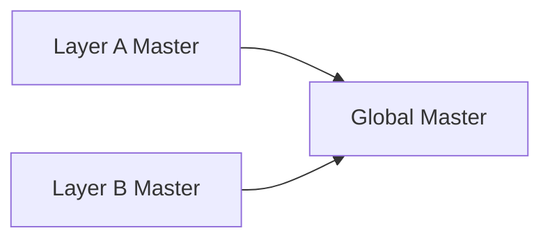

+++
title = "Audio Routing"
weight = 1
+++

## Signal Flow

<button type="button" class="wf-expand-btn" id="wf-expand-btn">&#10530; Expand</button>

Sonic Eddy &mdash; Signal Flow

Two identical, mirrored layers. Each layer carries 8 channels, 4 group buses, 2 layer sends/returns and a layer master. Both layers share Global Ret 1, Global Ret 2 and the Global Master.

REV A 8 CH &times; 2 LAYERS

<svg width="1720" height="1250" viewBox="0 0 1720 1250" style="position:absolute;left:0;top:0;overflow:visible;pointer-events:none">
  <defs>
    <marker id="ar" viewBox="0 0 10 10" refX="8.5" refY="5" markerWidth="5.5" markerHeight="5.5" orient="auto-start-reverse">
      <path d="M0.5,1 L9,5 L0.5,9 z" fill="var(--text)" />
    </marker>
  </defs>
  <line x1="176" y1="100" x2="505" y2="100" stroke="var(--accent)" stroke-width="1.6" stroke-linecap="round" opacity="0.95" />
  <line x1="505" y1="100" x2="800" y2="100" stroke="var(--accent)" stroke-width="1.6" stroke-linecap="round" stroke-dasharray="7 5" opacity="0.8" />
  <circle cx="250" cy="100" r="4.2" fill="var(--bg-card)" stroke="var(--accent)" stroke-width="1.4" />
  <circle cx="320" cy="100" r="4.2" fill="var(--bg-card)" stroke="var(--accent)" stroke-width="1.4" />
  <circle cx="390" cy="100" r="4.2" fill="var(--bg-card)" stroke="var(--accent)" stroke-width="1.4" />
  <circle cx="455" cy="100" r="4.2" fill="var(--bg-card)" stroke="var(--accent)" stroke-width="1.4" />
  <circle cx="505" cy="100" r="4.2" fill="var(--bg-card)" stroke="var(--accent)" stroke-width="1.4" />
  <circle cx="580" cy="100" r="4.2" fill="var(--bg-card)" stroke="var(--accent)" stroke-width="1.4" />
  <circle cx="640" cy="100" r="4.2" fill="var(--bg-card)" stroke="var(--accent)" stroke-width="1.4" />
  <circle cx="690" cy="100" r="4.2" fill="var(--bg-card)" stroke="var(--accent)" stroke-width="1.4" />
  <circle cx="745" cy="100" r="4.2" fill="var(--bg-card)" stroke="var(--accent)" stroke-width="1.4" />
  <line x1="176" y1="148" x2="505" y2="148" stroke="var(--accent)" stroke-width="1.6" stroke-linecap="round" opacity="0.95" />
  <line x1="505" y1="148" x2="800" y2="148" stroke="var(--accent)" stroke-width="1.6" stroke-linecap="round" stroke-dasharray="7 5" opacity="0.8" />
  <circle cx="250" cy="148" r="4.2" fill="var(--bg-card)" stroke="var(--accent)" stroke-width="1.4" />
  <circle cx="320" cy="148" r="4.2" fill="var(--bg-card)" stroke="var(--accent)" stroke-width="1.4" />
  <circle cx="390" cy="148" r="4.2" fill="var(--bg-card)" stroke="var(--accent)" stroke-width="1.4" />
  <circle cx="455" cy="148" r="4.2" fill="var(--bg-card)" stroke="var(--accent)" stroke-width="1.4" />
  <circle cx="505" cy="148" r="4.2" fill="var(--bg-card)" stroke="var(--accent)" stroke-width="1.4" />
  <circle cx="580" cy="148" r="4.2" fill="var(--bg-card)" stroke="var(--accent)" stroke-width="1.4" />
  <circle cx="640" cy="148" r="4.2" fill="var(--bg-card)" stroke="var(--accent)" stroke-width="1.4" />
  <circle cx="690" cy="148" r="4.2" fill="var(--bg-card)" stroke="var(--accent)" stroke-width="1.4" />
  <circle cx="745" cy="148" r="4.2" fill="var(--bg-card)" stroke="var(--accent)" stroke-width="1.4" />
  <line x1="176" y1="196" x2="505" y2="196" stroke="var(--accent)" stroke-width="1.6" stroke-linecap="round" opacity="0.95" />
  <line x1="505" y1="196" x2="800" y2="196" stroke="var(--accent)" stroke-width="1.6" stroke-linecap="round" stroke-dasharray="7 5" opacity="0.8" />
  <circle cx="250" cy="196" r="4.2" fill="var(--bg-card)" stroke="var(--accent)" stroke-width="1.4" />
  <circle cx="320" cy="196" r="4.2" fill="var(--bg-card)" stroke="var(--accent)" stroke-width="1.4" />
  <circle cx="390" cy="196" r="4.2" fill="var(--bg-card)" stroke="var(--accent)" stroke-width="1.4" />
  <circle cx="455" cy="196" r="4.2" fill="var(--bg-card)" stroke="var(--accent)" stroke-width="1.4" />
  <circle cx="505" cy="196" r="4.2" fill="var(--bg-card)" stroke="var(--accent)" stroke-width="1.4" />
  <circle cx="580" cy="196" r="4.2" fill="var(--bg-card)" stroke="var(--accent)" stroke-width="1.4" />
  <circle cx="640" cy="196" r="4.2" fill="var(--bg-card)" stroke="var(--accent)" stroke-width="1.4" />
  <circle cx="690" cy="196" r="4.2" fill="var(--bg-card)" stroke="var(--accent)" stroke-width="1.4" />
  <circle cx="745" cy="196" r="4.2" fill="var(--bg-card)" stroke="var(--accent)" stroke-width="1.4" />
  <line x1="176" y1="244" x2="505" y2="244" stroke="var(--accent)" stroke-width="1.6" stroke-linecap="round" opacity="0.95" />
  <line x1="505" y1="244" x2="800" y2="244" stroke="var(--accent)" stroke-width="1.6" stroke-linecap="round" stroke-dasharray="7 5" opacity="0.8" />
  <circle cx="250" cy="244" r="4.2" fill="var(--bg-card)" stroke="var(--accent)" stroke-width="1.4" />
  <circle cx="320" cy="244" r="4.2" fill="var(--bg-card)" stroke="var(--accent)" stroke-width="1.4" />
  <circle cx="390" cy="244" r="4.2" fill="var(--bg-card)" stroke="var(--accent)" stroke-width="1.4" />
  <circle cx="455" cy="244" r="4.2" fill="var(--bg-card)" stroke="var(--accent)" stroke-width="1.4" />
  <circle cx="505" cy="244" r="4.2" fill="var(--bg-card)" stroke="var(--accent)" stroke-width="1.4" />
  <circle cx="580" cy="244" r="4.2" fill="var(--bg-card)" stroke="var(--accent)" stroke-width="1.4" />
  <circle cx="640" cy="244" r="4.2" fill="var(--bg-card)" stroke="var(--accent)" stroke-width="1.4" />
  <circle cx="690" cy="244" r="4.2" fill="var(--bg-card)" stroke="var(--accent)" stroke-width="1.4" />
  <circle cx="745" cy="244" r="4.2" fill="var(--bg-card)" stroke="var(--accent)" stroke-width="1.4" />
  <line x1="176" y1="292" x2="505" y2="292" stroke="var(--accent)" stroke-width="1.6" stroke-linecap="round" opacity="0.95" />
  <line x1="505" y1="292" x2="800" y2="292" stroke="var(--accent)" stroke-width="1.6" stroke-linecap="round" stroke-dasharray="7 5" opacity="0.8" />
  <circle cx="250" cy="292" r="4.2" fill="var(--bg-card)" stroke="var(--accent)" stroke-width="1.4" />
  <circle cx="320" cy="292" r="4.2" fill="var(--bg-card)" stroke="var(--accent)" stroke-width="1.4" />
  <circle cx="390" cy="292" r="4.2" fill="var(--bg-card)" stroke="var(--accent)" stroke-width="1.4" />
  <circle cx="455" cy="292" r="4.2" fill="var(--bg-card)" stroke="var(--accent)" stroke-width="1.4" />
  <circle cx="505" cy="292" r="4.2" fill="var(--bg-card)" stroke="var(--accent)" stroke-width="1.4" />
  <circle cx="580" cy="292" r="4.2" fill="var(--bg-card)" stroke="var(--accent)" stroke-width="1.4" />
  <circle cx="640" cy="292" r="4.2" fill="var(--bg-card)" stroke="var(--accent)" stroke-width="1.4" />
  <circle cx="690" cy="292" r="4.2" fill="var(--bg-card)" stroke="var(--accent)" stroke-width="1.4" />
  <circle cx="745" cy="292" r="4.2" fill="var(--bg-card)" stroke="var(--accent)" stroke-width="1.4" />
  <line x1="176" y1="340" x2="505" y2="340" stroke="var(--accent)" stroke-width="1.6" stroke-linecap="round" opacity="0.95" />
  <line x1="505" y1="340" x2="800" y2="340" stroke="var(--accent)" stroke-width="1.6" stroke-linecap="round" stroke-dasharray="7 5" opacity="0.8" />
  <circle cx="250" cy="340" r="4.2" fill="var(--bg-card)" stroke="var(--accent)" stroke-width="1.4" />
  <circle cx="320" cy="340" r="4.2" fill="var(--bg-card)" stroke="var(--accent)" stroke-width="1.4" />
  <circle cx="390" cy="340" r="4.2" fill="var(--bg-card)" stroke="var(--accent)" stroke-width="1.4" />
  <circle cx="455" cy="340" r="4.2" fill="var(--bg-card)" stroke="var(--accent)" stroke-width="1.4" />
  <circle cx="505" cy="340" r="4.2" fill="var(--bg-card)" stroke="var(--accent)" stroke-width="1.4" />
  <circle cx="580" cy="340" r="4.2" fill="var(--bg-card)" stroke="var(--accent)" stroke-width="1.4" />
  <circle cx="640" cy="340" r="4.2" fill="var(--bg-card)" stroke="var(--accent)" stroke-width="1.4" />
  <circle cx="690" cy="340" r="4.2" fill="var(--bg-card)" stroke="var(--accent)" stroke-width="1.4" />
  <circle cx="745" cy="340" r="4.2" fill="var(--bg-card)" stroke="var(--accent)" stroke-width="1.4" />
  <line x1="176" y1="388" x2="505" y2="388" stroke="var(--accent)" stroke-width="1.6" stroke-linecap="round" opacity="0.95" />
  <line x1="505" y1="388" x2="800" y2="388" stroke="var(--accent)" stroke-width="1.6" stroke-linecap="round" stroke-dasharray="7 5" opacity="0.8" />
  <circle cx="250" cy="388" r="4.2" fill="var(--bg-card)" stroke="var(--accent)" stroke-width="1.4" />
  <circle cx="320" cy="388" r="4.2" fill="var(--bg-card)" stroke="var(--accent)" stroke-width="1.4" />
  <circle cx="390" cy="388" r="4.2" fill="var(--bg-card)" stroke="var(--accent)" stroke-width="1.4" />
  <circle cx="455" cy="388" r="4.2" fill="var(--bg-card)" stroke="var(--accent)" stroke-width="1.4" />
  <circle cx="505" cy="388" r="4.2" fill="var(--bg-card)" stroke="var(--accent)" stroke-width="1.4" />
  <circle cx="580" cy="388" r="4.2" fill="var(--bg-card)" stroke="var(--accent)" stroke-width="1.4" />
  <circle cx="640" cy="388" r="4.2" fill="var(--bg-card)" stroke="var(--accent)" stroke-width="1.4" />
  <circle cx="690" cy="388" r="4.2" fill="var(--bg-card)" stroke="var(--accent)" stroke-width="1.4" />
  <circle cx="745" cy="388" r="4.2" fill="var(--bg-card)" stroke="var(--accent)" stroke-width="1.4" />
  <line x1="176" y1="436" x2="505" y2="436" stroke="var(--accent)" stroke-width="1.6" stroke-linecap="round" opacity="0.95" />
  <line x1="505" y1="436" x2="800" y2="436" stroke="var(--accent)" stroke-width="1.6" stroke-linecap="round" stroke-dasharray="7 5" opacity="0.8" />
  <circle cx="250" cy="436" r="4.2" fill="var(--bg-card)" stroke="var(--accent)" stroke-width="1.4" />
  <circle cx="320" cy="436" r="4.2" fill="var(--bg-card)" stroke="var(--accent)" stroke-width="1.4" />
  <circle cx="390" cy="436" r="4.2" fill="var(--bg-card)" stroke="var(--accent)" stroke-width="1.4" />
  <circle cx="455" cy="436" r="4.2" fill="var(--bg-card)" stroke="var(--accent)" stroke-width="1.4" />
  <circle cx="505" cy="436" r="4.2" fill="var(--bg-card)" stroke="var(--accent)" stroke-width="1.4" />
  <circle cx="580" cy="436" r="4.2" fill="var(--bg-card)" stroke="var(--accent)" stroke-width="1.4" />
  <circle cx="640" cy="436" r="4.2" fill="var(--bg-card)" stroke="var(--accent)" stroke-width="1.4" />
  <circle cx="690" cy="436" r="4.2" fill="var(--bg-card)" stroke="var(--accent)" stroke-width="1.4" />
  <circle cx="745" cy="436" r="4.2" fill="var(--bg-card)" stroke="var(--accent)" stroke-width="1.4" />
  <line x1="250" y1="80" x2="250" y2="500" stroke="var(--accent)" stroke-width="1.6" stroke-linecap="round" opacity="0.95" />
  <line x1="290" y1="520" x2="800" y2="520" stroke="var(--accent)" stroke-width="1.6" stroke-linecap="round" stroke-dasharray="7 5" opacity="0.8" />
  <circle cx="580" cy="520" r="4.2" fill="var(--bg-card)" stroke="var(--accent)" stroke-width="1.4" />
  <circle cx="640" cy="520" r="4.2" fill="var(--bg-card)" stroke="var(--accent)" stroke-width="1.4" />
  <circle cx="690" cy="520" r="4.2" fill="var(--bg-card)" stroke="var(--accent)" stroke-width="1.4" />
  <circle cx="745" cy="520" r="4.2" fill="var(--bg-card)" stroke="var(--accent)" stroke-width="1.4" />
  <line x1="250" y1="540" x2="250" y2="870" stroke="var(--accent)" stroke-width="1.6" stroke-linecap="round" opacity="0.95" />
  <circle cx="250" cy="870" r="3.6" fill="var(--accent)" />
  <line x1="320" y1="80" x2="320" y2="560" stroke="var(--accent)" stroke-width="1.6" stroke-linecap="round" opacity="0.95" />
  <line x1="360" y1="580" x2="800" y2="580" stroke="var(--accent)" stroke-width="1.6" stroke-linecap="round" stroke-dasharray="7 5" opacity="0.8" />
  <circle cx="580" cy="580" r="4.2" fill="var(--bg-card)" stroke="var(--accent)" stroke-width="1.4" />
  <circle cx="640" cy="580" r="4.2" fill="var(--bg-card)" stroke="var(--accent)" stroke-width="1.4" />
  <circle cx="690" cy="580" r="4.2" fill="var(--bg-card)" stroke="var(--accent)" stroke-width="1.4" />
  <circle cx="745" cy="580" r="4.2" fill="var(--bg-card)" stroke="var(--accent)" stroke-width="1.4" />
  <line x1="320" y1="600" x2="320" y2="870" stroke="var(--accent)" stroke-width="1.6" stroke-linecap="round" opacity="0.95" />
  <circle cx="320" cy="870" r="3.6" fill="var(--accent)" />
  <line x1="390" y1="80" x2="390" y2="620" stroke="var(--accent)" stroke-width="1.6" stroke-linecap="round" opacity="0.95" />
  <line x1="430" y1="640" x2="800" y2="640" stroke="var(--accent)" stroke-width="1.6" stroke-linecap="round" stroke-dasharray="7 5" opacity="0.8" />
  <circle cx="580" cy="640" r="4.2" fill="var(--bg-card)" stroke="var(--accent)" stroke-width="1.4" />
  <circle cx="640" cy="640" r="4.2" fill="var(--bg-card)" stroke="var(--accent)" stroke-width="1.4" />
  <circle cx="690" cy="640" r="4.2" fill="var(--bg-card)" stroke="var(--accent)" stroke-width="1.4" />
  <circle cx="745" cy="640" r="4.2" fill="var(--bg-card)" stroke="var(--accent)" stroke-width="1.4" />
  <line x1="390" y1="660" x2="390" y2="870" stroke="var(--accent)" stroke-width="1.6" stroke-linecap="round" opacity="0.95" />
  <circle cx="390" cy="870" r="3.6" fill="var(--accent)" />
  <line x1="455" y1="80" x2="455" y2="680" stroke="var(--accent)" stroke-width="1.6" stroke-linecap="round" opacity="0.95" />
  <line x1="495" y1="700" x2="800" y2="700" stroke="var(--accent)" stroke-width="1.6" stroke-linecap="round" stroke-dasharray="7 5" opacity="0.8" />
  <circle cx="580" cy="700" r="4.2" fill="var(--bg-card)" stroke="var(--accent)" stroke-width="1.4" />
  <circle cx="640" cy="700" r="4.2" fill="var(--bg-card)" stroke="var(--accent)" stroke-width="1.4" />
  <circle cx="690" cy="700" r="4.2" fill="var(--bg-card)" stroke="var(--accent)" stroke-width="1.4" />
  <circle cx="745" cy="700" r="4.2" fill="var(--bg-card)" stroke="var(--accent)" stroke-width="1.4" />
  <line x1="455" y1="720" x2="455" y2="870" stroke="var(--accent)" stroke-width="1.6" stroke-linecap="round" opacity="0.95" />
  <circle cx="455" cy="870" r="3.6" fill="var(--accent)" />
  <line x1="250" y1="870" x2="505" y2="870" stroke="var(--accent)" stroke-width="1.6" stroke-linecap="round" opacity="0.95" />
  <circle cx="505" cy="870" r="3.6" fill="var(--accent)" />
  <line x1="505" y1="80" x2="505" y2="900" stroke="var(--accent)" stroke-width="2.72" stroke-linecap="round" opacity="0.95" />
  <line x1="580" y1="80" x2="580" y2="750" stroke="var(--accent)" stroke-width="1.6" stroke-linecap="round" stroke-dasharray="7 5" opacity="0.8" />
  <line x1="640" y1="80" x2="640" y2="810" stroke="var(--accent)" stroke-width="1.6" stroke-linecap="round" stroke-dasharray="7 5" opacity="0.8" />
  <line x1="690" y1="80" x2="690" y2="945" stroke="var(--accent)" stroke-width="1.6" stroke-linecap="round" stroke-dasharray="7 5" opacity="0.8" />
  <line x1="745" y1="80" x2="745" y2="855" stroke="var(--accent)" stroke-width="1.6" stroke-linecap="round" stroke-dasharray="7 5" opacity="0.8" />
  <polyline points="580,790 580,890 505,890" fill="none" stroke="var(--accent)" stroke-width="2.08" stroke-linejoin="round" opacity="0.95" />
  <polyline points="640,850 640,890 505,890" fill="none" stroke="var(--accent)" stroke-width="2.08" stroke-linejoin="round" opacity="0.95" />
  <circle cx="505" cy="890" r="3.6" fill="var(--accent)" />
  <polyline points="450,955 450,1130 700,1130" fill="none" stroke="var(--accent)" stroke-width="2.08" stroke-linejoin="round" opacity="0.95" marker-end="url(#ar)" />
  <line x1="1544" y1="100" x2="1215" y2="100" stroke="var(--accent-b)" stroke-width="1.6" stroke-linecap="round" opacity="0.95" />
  <line x1="1215" y1="100" x2="920" y2="100" stroke="var(--accent-b)" stroke-width="1.6" stroke-linecap="round" stroke-dasharray="7 5" opacity="0.8" />
  <circle cx="1470" cy="100" r="4.2" fill="var(--bg-card)" stroke="var(--accent-b)" stroke-width="1.4" />
  <circle cx="1400" cy="100" r="4.2" fill="var(--bg-card)" stroke="var(--accent-b)" stroke-width="1.4" />
  <circle cx="1330" cy="100" r="4.2" fill="var(--bg-card)" stroke="var(--accent-b)" stroke-width="1.4" />
  <circle cx="1265" cy="100" r="4.2" fill="var(--bg-card)" stroke="var(--accent-b)" stroke-width="1.4" />
  <circle cx="1215" cy="100" r="4.2" fill="var(--bg-card)" stroke="var(--accent-b)" stroke-width="1.4" />
  <circle cx="1140" cy="100" r="4.2" fill="var(--bg-card)" stroke="var(--accent-b)" stroke-width="1.4" />
  <circle cx="1080" cy="100" r="4.2" fill="var(--bg-card)" stroke="var(--accent-b)" stroke-width="1.4" />
  <circle cx="1030" cy="100" r="4.2" fill="var(--bg-card)" stroke="var(--accent-b)" stroke-width="1.4" />
  <circle cx="975" cy="100" r="4.2" fill="var(--bg-card)" stroke="var(--accent-b)" stroke-width="1.4" />
  <line x1="1544" y1="148" x2="1215" y2="148" stroke="var(--accent-b)" stroke-width="1.6" stroke-linecap="round" opacity="0.95" />
  <line x1="1215" y1="148" x2="920" y2="148" stroke="var(--accent-b)" stroke-width="1.6" stroke-linecap="round" stroke-dasharray="7 5" opacity="0.8" />
  <circle cx="1470" cy="148" r="4.2" fill="var(--bg-card)" stroke="var(--accent-b)" stroke-width="1.4" />
  <circle cx="1400" cy="148" r="4.2" fill="var(--bg-card)" stroke="var(--accent-b)" stroke-width="1.4" />
  <circle cx="1330" cy="148" r="4.2" fill="var(--bg-card)" stroke="var(--accent-b)" stroke-width="1.4" />
  <circle cx="1265" cy="148" r="4.2" fill="var(--bg-card)" stroke="var(--accent-b)" stroke-width="1.4" />
  <circle cx="1215" cy="148" r="4.2" fill="var(--bg-card)" stroke="var(--accent-b)" stroke-width="1.4" />
  <circle cx="1140" cy="148" r="4.2" fill="var(--bg-card)" stroke="var(--accent-b)" stroke-width="1.4" />
  <circle cx="1080" cy="148" r="4.2" fill="var(--bg-card)" stroke="var(--accent-b)" stroke-width="1.4" />
  <circle cx="1030" cy="148" r="4.2" fill="var(--bg-card)" stroke="var(--accent-b)" stroke-width="1.4" />
  <circle cx="975" cy="148" r="4.2" fill="var(--bg-card)" stroke="var(--accent-b)" stroke-width="1.4" />
  <line x1="1544" y1="196" x2="1215" y2="196" stroke="var(--accent-b)" stroke-width="1.6" stroke-linecap="round" opacity="0.95" />
  <line x1="1215" y1="196" x2="920" y2="196" stroke="var(--accent-b)" stroke-width="1.6" stroke-linecap="round" stroke-dasharray="7 5" opacity="0.8" />
  <circle cx="1470" cy="196" r="4.2" fill="var(--bg-card)" stroke="var(--accent-b)" stroke-width="1.4" />
  <circle cx="1400" cy="196" r="4.2" fill="var(--bg-card)" stroke="var(--accent-b)" stroke-width="1.4" />
  <circle cx="1330" cy="196" r="4.2" fill="var(--bg-card)" stroke="var(--accent-b)" stroke-width="1.4" />
  <circle cx="1265" cy="196" r="4.2" fill="var(--bg-card)" stroke="var(--accent-b)" stroke-width="1.4" />
  <circle cx="1215" cy="196" r="4.2" fill="var(--bg-card)" stroke="var(--accent-b)" stroke-width="1.4" />
  <circle cx="1140" cy="196" r="4.2" fill="var(--bg-card)" stroke="var(--accent-b)" stroke-width="1.4" />
  <circle cx="1080" cy="196" r="4.2" fill="var(--bg-card)" stroke="var(--accent-b)" stroke-width="1.4" />
  <circle cx="1030" cy="196" r="4.2" fill="var(--bg-card)" stroke="var(--accent-b)" stroke-width="1.4" />
  <circle cx="975" cy="196" r="4.2" fill="var(--bg-card)" stroke="var(--accent-b)" stroke-width="1.4" />
  <line x1="1544" y1="244" x2="1215" y2="244" stroke="var(--accent-b)" stroke-width="1.6" stroke-linecap="round" opacity="0.95" />
  <line x1="1215" y1="244" x2="920" y2="244" stroke="var(--accent-b)" stroke-width="1.6" stroke-linecap="round" stroke-dasharray="7 5" opacity="0.8" />
  <circle cx="1470" cy="244" r="4.2" fill="var(--bg-card)" stroke="var(--accent-b)" stroke-width="1.4" />
  <circle cx="1400" cy="244" r="4.2" fill="var(--bg-card)" stroke="var(--accent-b)" stroke-width="1.4" />
  <circle cx="1330" cy="244" r="4.2" fill="var(--bg-card)" stroke="var(--accent-b)" stroke-width="1.4" />
  <circle cx="1265" cy="244" r="4.2" fill="var(--bg-card)" stroke="var(--accent-b)" stroke-width="1.4" />
  <circle cx="1215" cy="244" r="4.2" fill="var(--bg-card)" stroke="var(--accent-b)" stroke-width="1.4" />
  <circle cx="1140" cy="244" r="4.2" fill="var(--bg-card)" stroke="var(--accent-b)" stroke-width="1.4" />
  <circle cx="1080" cy="244" r="4.2" fill="var(--bg-card)" stroke="var(--accent-b)" stroke-width="1.4" />
  <circle cx="1030" cy="244" r="4.2" fill="var(--bg-card)" stroke="var(--accent-b)" stroke-width="1.4" />
  <circle cx="975" cy="244" r="4.2" fill="var(--bg-card)" stroke="var(--accent-b)" stroke-width="1.4" />
  <line x1="1544" y1="292" x2="1215" y2="292" stroke="var(--accent-b)" stroke-width="1.6" stroke-linecap="round" opacity="0.95" />
  <line x1="1215" y1="292" x2="920" y2="292" stroke="var(--accent-b)" stroke-width="1.6" stroke-linecap="round" stroke-dasharray="7 5" opacity="0.8" />
  <circle cx="1470" cy="292" r="4.2" fill="var(--bg-card)" stroke="var(--accent-b)" stroke-width="1.4" />
  <circle cx="1400" cy="292" r="4.2" fill="var(--bg-card)" stroke="var(--accent-b)" stroke-width="1.4" />
  <circle cx="1330" cy="292" r="4.2" fill="var(--bg-card)" stroke="var(--accent-b)" stroke-width="1.4" />
  <circle cx="1265" cy="292" r="4.2" fill="var(--bg-card)" stroke="var(--accent-b)" stroke-width="1.4" />
  <circle cx="1215" cy="292" r="4.2" fill="var(--bg-card)" stroke="var(--accent-b)" stroke-width="1.4" />
  <circle cx="1140" cy="292" r="4.2" fill="var(--bg-card)" stroke="var(--accent-b)" stroke-width="1.4" />
  <circle cx="1080" cy="292" r="4.2" fill="var(--bg-card)" stroke="var(--accent-b)" stroke-width="1.4" />
  <circle cx="1030" cy="292" r="4.2" fill="var(--bg-card)" stroke="var(--accent-b)" stroke-width="1.4" />
  <circle cx="975" cy="292" r="4.2" fill="var(--bg-card)" stroke="var(--accent-b)" stroke-width="1.4" />
  <line x1="1544" y1="340" x2="1215" y2="340" stroke="var(--accent-b)" stroke-width="1.6" stroke-linecap="round" opacity="0.95" />
  <line x1="1215" y1="340" x2="920" y2="340" stroke="var(--accent-b)" stroke-width="1.6" stroke-linecap="round" stroke-dasharray="7 5" opacity="0.8" />
  <circle cx="1470" cy="340" r="4.2" fill="var(--bg-card)" stroke="var(--accent-b)" stroke-width="1.4" />
  <circle cx="1400" cy="340" r="4.2" fill="var(--bg-card)" stroke="var(--accent-b)" stroke-width="1.4" />
  <circle cx="1330" cy="340" r="4.2" fill="var(--bg-card)" stroke="var(--accent-b)" stroke-width="1.4" />
  <circle cx="1265" cy="340" r="4.2" fill="var(--bg-card)" stroke="var(--accent-b)" stroke-width="1.4" />
  <circle cx="1215" cy="340" r="4.2" fill="var(--bg-card)" stroke="var(--accent-b)" stroke-width="1.4" />
  <circle cx="1140" cy="340" r="4.2" fill="var(--bg-card)" stroke="var(--accent-b)" stroke-width="1.4" />
  <circle cx="1080" cy="340" r="4.2" fill="var(--bg-card)" stroke="var(--accent-b)" stroke-width="1.4" />
  <circle cx="1030" cy="340" r="4.2" fill="var(--bg-card)" stroke="var(--accent-b)" stroke-width="1.4" />
  <circle cx="975" cy="340" r="4.2" fill="var(--bg-card)" stroke="var(--accent-b)" stroke-width="1.4" />
  <line x1="1544" y1="388" x2="1215" y2="388" stroke="var(--accent-b)" stroke-width="1.6" stroke-linecap="round" opacity="0.95" />
  <line x1="1215" y1="388" x2="920" y2="388" stroke="var(--accent-b)" stroke-width="1.6" stroke-linecap="round" stroke-dasharray="7 5" opacity="0.8" />
  <circle cx="1470" cy="388" r="4.2" fill="var(--bg-card)" stroke="var(--accent-b)" stroke-width="1.4" />
  <circle cx="1400" cy="388" r="4.2" fill="var(--bg-card)" stroke="var(--accent-b)" stroke-width="1.4" />
  <circle cx="1330" cy="388" r="4.2" fill="var(--bg-card)" stroke="var(--accent-b)" stroke-width="1.4" />
  <circle cx="1265" cy="388" r="4.2" fill="var(--bg-card)" stroke="var(--accent-b)" stroke-width="1.4" />
  <circle cx="1215" cy="388" r="4.2" fill="var(--bg-card)" stroke="var(--accent-b)" stroke-width="1.4" />
  <circle cx="1140" cy="388" r="4.2" fill="var(--bg-card)" stroke="var(--accent-b)" stroke-width="1.4" />
  <circle cx="1080" cy="388" r="4.2" fill="var(--bg-card)" stroke="var(--accent-b)" stroke-width="1.4" />
  <circle cx="1030" cy="388" r="4.2" fill="var(--bg-card)" stroke="var(--accent-b)" stroke-width="1.4" />
  <circle cx="975" cy="388" r="4.2" fill="var(--bg-card)" stroke="var(--accent-b)" stroke-width="1.4" />
  <line x1="1544" y1="436" x2="1215" y2="436" stroke="var(--accent-b)" stroke-width="1.6" stroke-linecap="round" opacity="0.95" />
  <line x1="1215" y1="436" x2="920" y2="436" stroke="var(--accent-b)" stroke-width="1.6" stroke-linecap="round" stroke-dasharray="7 5" opacity="0.8" />
  <circle cx="1470" cy="436" r="4.2" fill="var(--bg-card)" stroke="var(--accent-b)" stroke-width="1.4" />
  <circle cx="1400" cy="436" r="4.2" fill="var(--bg-card)" stroke="var(--accent-b)" stroke-width="1.4" />
  <circle cx="1330" cy="436" r="4.2" fill="var(--bg-card)" stroke="var(--accent-b)" stroke-width="1.4" />
  <circle cx="1265" cy="436" r="4.2" fill="var(--bg-card)" stroke="var(--accent-b)" stroke-width="1.4" />
  <circle cx="1215" cy="436" r="4.2" fill="var(--bg-card)" stroke="var(--accent-b)" stroke-width="1.4" />
  <circle cx="1140" cy="436" r="4.2" fill="var(--bg-card)" stroke="var(--accent-b)" stroke-width="1.4" />
  <circle cx="1080" cy="436" r="4.2" fill="var(--bg-card)" stroke="var(--accent-b)" stroke-width="1.4" />
  <circle cx="1030" cy="436" r="4.2" fill="var(--bg-card)" stroke="var(--accent-b)" stroke-width="1.4" />
  <circle cx="975" cy="436" r="4.2" fill="var(--bg-card)" stroke="var(--accent-b)" stroke-width="1.4" />
  <line x1="1470" y1="80" x2="1470" y2="500" stroke="var(--accent-b)" stroke-width="1.6" stroke-linecap="round" opacity="0.95" />
  <line x1="1430" y1="520" x2="920" y2="520" stroke="var(--accent-b)" stroke-width="1.6" stroke-linecap="round" stroke-dasharray="7 5" opacity="0.8" />
  <circle cx="1140" cy="520" r="4.2" fill="var(--bg-card)" stroke="var(--accent-b)" stroke-width="1.4" />
  <circle cx="1080" cy="520" r="4.2" fill="var(--bg-card)" stroke="var(--accent-b)" stroke-width="1.4" />
  <circle cx="1030" cy="520" r="4.2" fill="var(--bg-card)" stroke="var(--accent-b)" stroke-width="1.4" />
  <circle cx="975" cy="520" r="4.2" fill="var(--bg-card)" stroke="var(--accent-b)" stroke-width="1.4" />
  <line x1="1470" y1="540" x2="1470" y2="870" stroke="var(--accent-b)" stroke-width="1.6" stroke-linecap="round" opacity="0.95" />
  <circle cx="1470" cy="870" r="3.6" fill="var(--accent-b)" />
  <line x1="1400" y1="80" x2="1400" y2="560" stroke="var(--accent-b)" stroke-width="1.6" stroke-linecap="round" opacity="0.95" />
  <line x1="1360" y1="580" x2="920" y2="580" stroke="var(--accent-b)" stroke-width="1.6" stroke-linecap="round" stroke-dasharray="7 5" opacity="0.8" />
  <circle cx="1140" cy="580" r="4.2" fill="var(--bg-card)" stroke="var(--accent-b)" stroke-width="1.4" />
  <circle cx="1080" cy="580" r="4.2" fill="var(--bg-card)" stroke="var(--accent-b)" stroke-width="1.4" />
  <circle cx="1030" cy="580" r="4.2" fill="var(--bg-card)" stroke="var(--accent-b)" stroke-width="1.4" />
  <circle cx="975" cy="580" r="4.2" fill="var(--bg-card)" stroke="var(--accent-b)" stroke-width="1.4" />
  <line x1="1400" y1="600" x2="1400" y2="870" stroke="var(--accent-b)" stroke-width="1.6" stroke-linecap="round" opacity="0.95" />
  <circle cx="1400" cy="870" r="3.6" fill="var(--accent-b)" />
  <line x1="1330" y1="80" x2="1330" y2="620" stroke="var(--accent-b)" stroke-width="1.6" stroke-linecap="round" opacity="0.95" />
  <line x1="1290" y1="640" x2="920" y2="640" stroke="var(--accent-b)" stroke-width="1.6" stroke-linecap="round" stroke-dasharray="7 5" opacity="0.8" />
  <circle cx="1140" cy="640" r="4.2" fill="var(--bg-card)" stroke="var(--accent-b)" stroke-width="1.4" />
  <circle cx="1080" cy="640" r="4.2" fill="var(--bg-card)" stroke="var(--accent-b)" stroke-width="1.4" />
  <circle cx="1030" cy="640" r="4.2" fill="var(--bg-card)" stroke="var(--accent-b)" stroke-width="1.4" />
  <circle cx="975" cy="640" r="4.2" fill="var(--bg-card)" stroke="var(--accent-b)" stroke-width="1.4" />
  <line x1="1330" y1="660" x2="1330" y2="870" stroke="var(--accent-b)" stroke-width="1.6" stroke-linecap="round" opacity="0.95" />
  <circle cx="1330" cy="870" r="3.6" fill="var(--accent-b)" />
  <line x1="1265" y1="80" x2="1265" y2="680" stroke="var(--accent-b)" stroke-width="1.6" stroke-linecap="round" opacity="0.95" />
  <line x1="1225" y1="700" x2="920" y2="700" stroke="var(--accent-b)" stroke-width="1.6" stroke-linecap="round" stroke-dasharray="7 5" opacity="0.8" />
  <circle cx="1140" cy="700" r="4.2" fill="var(--bg-card)" stroke="var(--accent-b)" stroke-width="1.4" />
  <circle cx="1080" cy="700" r="4.2" fill="var(--bg-card)" stroke="var(--accent-b)" stroke-width="1.4" />
  <circle cx="1030" cy="700" r="4.2" fill="var(--bg-card)" stroke="var(--accent-b)" stroke-width="1.4" />
  <circle cx="975" cy="700" r="4.2" fill="var(--bg-card)" stroke="var(--accent-b)" stroke-width="1.4" />
  <line x1="1265" y1="720" x2="1265" y2="870" stroke="var(--accent-b)" stroke-width="1.6" stroke-linecap="round" opacity="0.95" />
  <circle cx="1265" cy="870" r="3.6" fill="var(--accent-b)" />
  <line x1="1470" y1="870" x2="1215" y2="870" stroke="var(--accent-b)" stroke-width="1.6" stroke-linecap="round" opacity="0.95" />
  <circle cx="1215" cy="870" r="3.6" fill="var(--accent-b)" />
  <line x1="1215" y1="80" x2="1215" y2="900" stroke="var(--accent-b)" stroke-width="2.72" stroke-linecap="round" opacity="0.95" />
  <line x1="1140" y1="80" x2="1140" y2="750" stroke="var(--accent-b)" stroke-width="1.6" stroke-linecap="round" stroke-dasharray="7 5" opacity="0.8" />
  <line x1="1080" y1="80" x2="1080" y2="810" stroke="var(--accent-b)" stroke-width="1.6" stroke-linecap="round" stroke-dasharray="7 5" opacity="0.8" />
  <line x1="1030" y1="80" x2="1030" y2="945" stroke="var(--accent-b)" stroke-width="1.6" stroke-linecap="round" stroke-dasharray="7 5" opacity="0.8" />
  <line x1="975" y1="80" x2="975" y2="855" stroke="var(--accent-b)" stroke-width="1.6" stroke-linecap="round" stroke-dasharray="7 5" opacity="0.8" />
  <polyline points="1140,790 1140,890 1215,890" fill="none" stroke="var(--accent-b)" stroke-width="2.08" stroke-linejoin="round" opacity="0.95" />
  <polyline points="1080,850 1080,890 1215,890" fill="none" stroke="var(--accent-b)" stroke-width="2.08" stroke-linejoin="round" opacity="0.95" />
  <circle cx="1215" cy="890" r="3.6" fill="var(--accent-b)" />
  <polyline points="1270,955 1270,1130 1020,1130" fill="none" stroke="var(--accent-b)" stroke-width="2.08" stroke-linejoin="round" opacity="0.95" marker-end="url(#ar)" />
  <polyline points="1000,910 1000,925 1120,925 1120,1050 940,1050 940,1090" fill="none" stroke="var(--text)" stroke-width="2.72" stroke-linejoin="round" marker-end="url(#ar)" />
  <polyline points="860,1000 860,1090" fill="none" stroke="var(--text)" stroke-width="2.72" stroke-linejoin="round" marker-end="url(#ar)" />
  <polyline points="860,1170 860,1210" fill="none" stroke="var(--text)" stroke-width="2.72" stroke-linejoin="round" marker-end="url(#ar)" />
  <text x="884" y="1204" fill="var(--text)" font-size="12" font-family="var(--font-mono)" letter-spacing="0.12em">MAIN OUT</text>
</svg>

LAYER A

LAYER B

G1

G2

G3

G4

MST

S&#9656;R1

S&#9656;R2

S&#9656;GR2

S&#9656;GR1

G1

G2

G3

G4

MST

S&#9656;R1

S&#9656;R2

S&#9656;GR2

S&#9656;GR1

CH 01

CH 02

CH 03

CH 04

CH 05

CH 06

CH 07

CH 08

G1

G2

G3

G4

RET 1

RET 2

LAYER MASTER

CH 01

CH 02

CH 03

CH 04

CH 05

CH 06

CH 07

CH 08

G1

G2

G3

G4

RET 1

RET 2

LAYER MASTER

GLOBAL RET 1

GLOBAL RET 2

GLOBAL MASTER

LEGEND

signal path

send bus

crosspoint &mdash; assignable per channel

hard-wired junction

Column keys: G1&ndash;G4 group assign &middot; MST layer master &middot; S&#9656;R1/R2 layer sends &middot; S&#9656;GR1/GR2 global sends.

Sonic Eddy provides five channel types in order to provide the user with
flexible ways to organize the signal flow. The normal audio channels take any
pipewire node as input, and route its signal either to a group, or a master
channel, and to any combination of the return channels.

Group and master channels allow processing of the sum of multiple channel
signals.

Sonic Eddy provides two layers, layer A and layer B. Each layer provides 8
channels, 4 group channels, and a master channel. The master channels come
together in the global master, where the contribution of each layer is selected
by a cross-fader. This setup enabled the simultaneous setup of two different
signal path mixed together in the global master.

Every channel, except the return channels, provide another tool directed at live
performances, a looper, constantly recording and ready to loop the last bar, 0r
4, or 8. A powerful tool to switch presets on a synthesizer, currently still
playing the bass line.

## Channels

Each channel picks up audio signals from exactly one pipewire playback node. The
connection is managed by wireplumber and created by setting the target node on
the relevant node of the channel. The signal goes through a trim section, where
it can be raised, or lowered depending on the needs of the signal chain.

Next follows the pre-effects looper, and then the optional filter chain. The
send section after the filter chain allows routing the signal to one of the four
return channels of the layer.

The post-effect looper allows recording and playback of the signal effected by
the filter chain. The following volume and pan section allows setting volume and
pan, and the audio to routing section finally allows the selection of the
channels destination, either the layers master channel, or one of the group
channels.

## Group Channels

Group channels get their signal fed by normal channels. The signal of every
normal channel is summed and then processed, starting with the pre-effects
looper. The pre-effects looper is followed by the optional filter chain, the
post-effects looper, and the send section.

The following volume and pan section allows mixing the signal into the master
channel.

## Return Channels

The return channels are fed by the send section of the normal channels and the
group channels. Signal they receive is processed by an optional filter chain,
and then a volume and pan section, mixing the signal into the layers master
channel.

## Global Master

The global master channel sums layer A master and layer B master together with a
cross-fader. A filter chain can be added after the cross-fader, processing the
summed signal.

## Channel Signal Flow

Sonic Eddy channels takes inputs from any pipewire playback node, connecting to
the first two ports of the node. Virtual inputs can be used, if better control
over the respective ports is required.

The inputs are routed through a channel. Channels can have a filter chain or
external effect, which applies LV2 plugins to the audio signal. Every channel
also has two looper, one before the filter chain, one after. The looper allow to
record incoming audio, and play it back perfectly synchronized. This allows, for
example, to completely change the settings of a synthesizer while the looper
plays the old melody.

Further processing is split after the post effects looper. Four send controls
allow passing the signal to one of the four return channels. The main audio
stream is processed by a volume and pan section, and then forwarded either
directly to the layer master, or to one of the group channels of the layer. The
target is selected in the Audio To section.





The group and return channels can also contain a filter chain or external
effects, providing ample opportunities to shape the audio signal.

## Channel Controls

Each channel has very similar controls, only depending on which features the
specific channel presents to the user.

### Normal Channels

### Group Channels

### Master Channels

## The Two Layers

### The Global Master

The global master channel can be accessed with the main menu at
`Mixer -> Global Master`.

